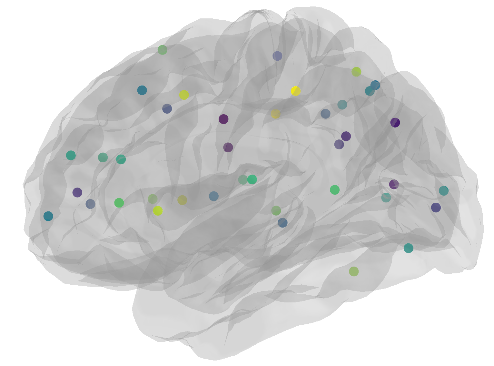

## Nilearn

| Viewing 3D MR brain image |
|:---:|
| |

| Correlation matrix on a glass brain |
|:---:|
| |

| Regions as markers on a glass brain |
|:---:|
| |

## FSLEyes - Harvard Oxford Atlas

    fsleyes /usr/local/fsl/data/atlases/HarvardOxford/HarvardOxford-cort-maxprob-thr25-2mm.nii.gz

## MRtrix3 - Tractogram visualization

    mrview dwi_den_preproc_unbiased.mif -tractography.load smallerTracks_200k.tck