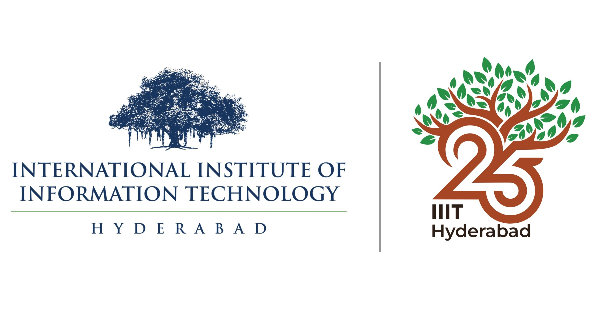

       
**NOTE**: Content from the 17/08/2024 session is uploaded. Please check [<b>here</b>](outline)

# Welcome!
Hello everyone and welcome to the "MRI and EEG data analysis" workshop that will take place
at the International Institute of Information Technology Hyderabad organized by Cognitive
Science Lab & IHub-Data, IIITH.

# Overview of the workshop

The overall idea of this workshop is to train attendees how to begin with brain data analysis, 
 familiarize with Neuroimaging workflows/pipelines that include processing multiple modalities
of Neuroimaging.

 This workshop is conducted every **Saturday** starting from **August 10th 2024** that runs over complete semester covering several topics conduting in multiple sessions each week. In the initial days, we will cover brief overview of the data types and data organization that the Neuroimaging community prefer, followed by basics in data handling and visualization such that the stage is set for actual data analysis/workflows. For a precise outline of this workshop, please consult the respective [page](outline "Outline of the workshop").

This workshop utilizes pre-coded packages or softwares that are easy to download and install. Mostly
coded in Python, MATLAB, C++ etc. For hands on practicising, we can rely on Jupyter notebooks. 
All the content will be provided in Jupyter notebooks or bash scripts.

# When is the workshop?

The workshop will start from **August 10th 2024 3-5pm**, every Saturday and it continues for entire Monsoon semester. Each week every Saturday we will have sessions
that cover several topics as outlined below.

# Where is the workshop?

August 10th CR1 in Vindhya Building, IIITH

From August 17th, **SH1** in Vindhya Building, IIITH

# Skeleton of the workshop

[Outline of the planned topics](outline "Outline of the workshop")

# Registration is closed

~~This workshop is free but registration is mandatory.~~

~~A brief statement of purpose (250 words max.) along with lab details is mandatory~~
~~for the registration. If you are a Master's or PhD student, topic and domain of the thesis~~
~~is desired.~~

# Hope to see you soon!!

# Any queries/enquiries?

Contact: kamalaker.dadi@research.iiit.ac.in

___

<figure>
    
    
</figure>
