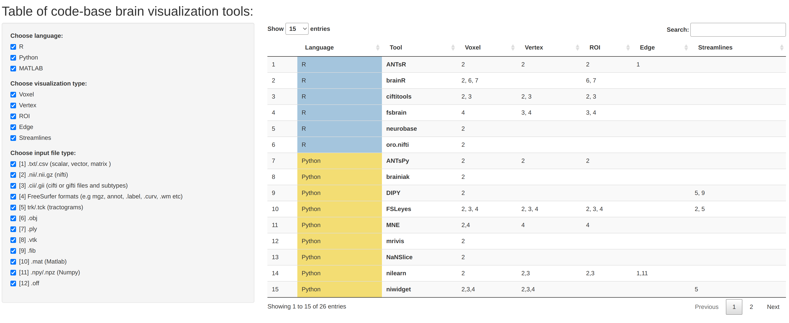
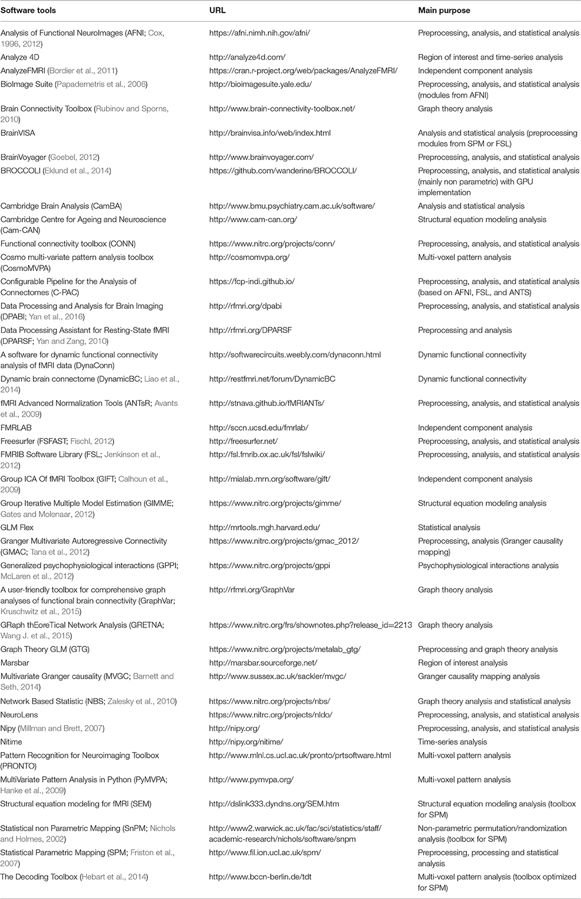

# Summary of the introductory session: Understanding MRI scans and Breadth of datasets & Softwares

The goal of this session is to introduce you to several concepts in handling
 the magnetic resonance imaging (MRI) data acquired on humans. This session
 will help you get started with the processing of the MRI data including:
different formats of the MRI files, types of MR modalities that are commonly
 acquired and more importantly a prerequisite for the upcoming sessions.

Neuroimaging has been bringing in terabytes of high-resolution functional
and anatomical brain images, uncovering the neural basis of individual
 differences in behavior and cognition. The most prominent examples
are [[OpenNeuro]](#1), [[the Human Connectome Project]](#2), [[the NKI-Rockland sample]](#3),
[[the UK Biobank]](#4), [ADNI](https://adni.loni.usc.edu/) and soon.

It is also important to recognize a multitude of preprocessing and analysis software packages
for reproducible science in Neuroimaging. To name a few [[A Practical Guide for Generating Reproducible and Programmatic Neuroimaging Visualizations]](#5).

Software tools used for fMRI pipelines present in published studies [[Hitchhiker's Guide]](#6)

## References
<a id="1">[OpenNeuro]</a>
Christopher JM, et al. and Russell P. (2021).
The OpenNeuro resource for sharing of neuroscience data.
eLife 10:e71774.

<a id="2">[HCP]</a>
Van Essen DC, et al. (2013).
The WU-Minn Human Connectome Project: an overview.
NeuroImage 80:62--79.

<a id="3">[NKI]</a>
Courtney W, et al. and Milham MP. (2012).
The NKI-Rockland Sample: A Model for Accelerating the Pace of Discovery Science in Psychiatry.
Frontiers in Neuroscience 6:152.

<a id="4">[UK Biobank]</a>
Littlejohns TJ, et al. (2020).
The UK Biobank imaging enhancement of 100,000 participants: rationale, data collection, management and future directions.
Nature Communications 11:2624.

<a id="5">[Aperture Neuro]</a>
Chopra S, et al. and Holmes A. (2023).
A Practical Guide for Generating Reproducible and Programmatic Neuroimaging Visualizations.
Aperture Neuro. 3:1-20.

<a id="6">[Hitchhiker's Guide]</a>
Soares JM, et al. (2016).
A Hitchhiker's Guide to Functional Magnetic Resonance Imaging.
Front Neurosci. 10:515.
